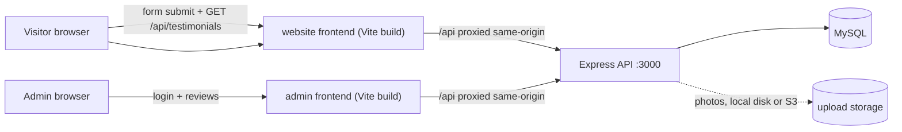
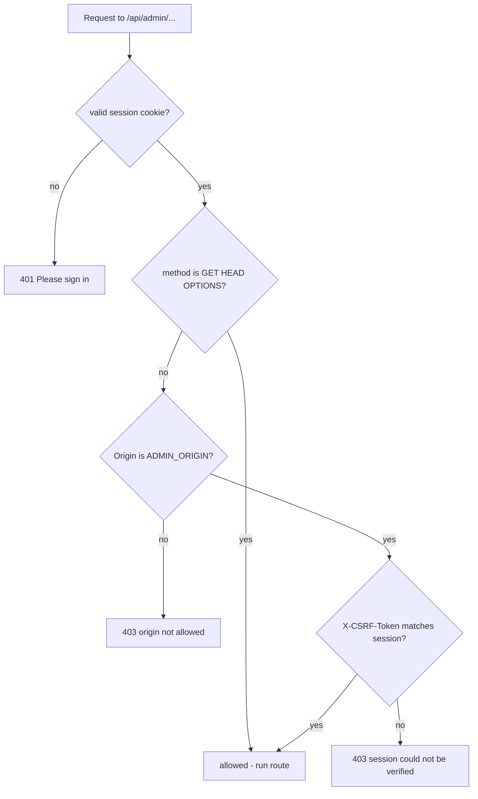
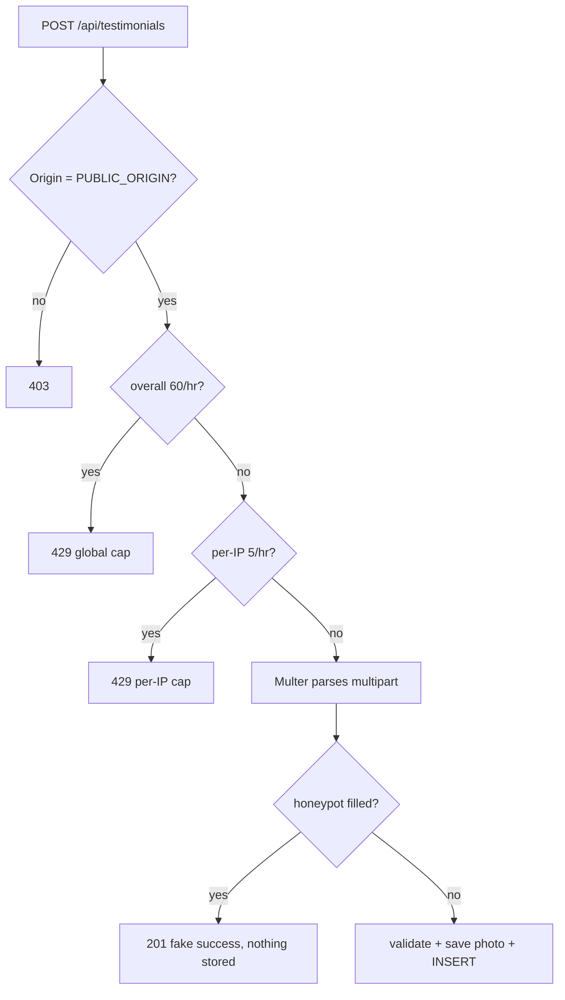

# EXPLANATION.md — How the entire codebase works

This guide walks through every part of the testimonials project and explains
**how the pieces fit together**. It is written for someone comfortable with the
basics of web development (you know what HTTP, HTML, CSS, JavaScript, and a
database are) but new to this particular stack. Nothing specific to this
codebase is assumed to be trivial — if there is a concept that trips up new
readers (what a middleware is, what a cookie flag means, why that hashing step
exists), it is explained where it first matters.

The short version of the whole project:

> **A public website** where anyone can leave a testimonial.
> **A private admin dashboard** where one person reviews those submissions and
> decides which ones are published.
> **A single Express API** that both websites talk to, backed by **MySQL**,
> with photos stored either on disk or in S3-compatible object storage.

---

## Contents

1. [The big picture](#1-the-big-picture)
2. [A vocabulary primer (concepts this codebase leans on)](#2-a-vocabulary-primer)
3. [The repository, file by file](#3-the-repository-file-by-file)
4. [Follow one visitor: submitting a testimonial](#4-follow-one-visitor-submitting-a-testimonial)
5. [The middleware pipeline, explained](#5-the-middleware-pipeline-explained)
6. [Routing: every route the API exposes](#6-routing-every-route-the-api-exposes)
7. [Authentication: how login and sessions work](#7-authentication-how-login-and-sessions-work)
8. [Authorization: who is allowed to do what](#8-authorization-who-is-allowed-to-do-what)
9. [The admin review workflow](#9-the-admin-review-workflow)
10. [The photo pipeline](#10-the-photo-pipeline)
11. [The database and schema](#11-the-database-and-schema)
12. [Input validation and normalisation](#12-input-validation-and-normalisation)
13. [Error handling and the 404 catch-all](#13-error-handling-and-the-404-catch-all)
14. [The shared helpers](#14-the-shared-helpers)
15. [Configuration via environment variables](#15-configuration-via-environment-variables)
16. [The security model, summarised](#16-the-security-model-summarised)
17. [The tests](#17-the-tests)
18. [Deployment architectures](#18-deployment-architectures)
19. [Where to look next](#19-where-to-look-next)

---

## 1. The big picture

This is an **npm workspaces monorepo**. A monorepo is one git repository that
contains several independently named packages. Here those packages live under
`apps/` and are declared in the root `package.json`'s `workspaces` field:

```text
apps/
  website/   The public site (form + wall of testimonials). Port 5173 in dev.
  admin/     The private dashboard (sign in, review, export). Port 5174 in dev.
  api/       The Express API (all data + business logic). Port 3000 in dev.
  shared/    TypeScript helpers and CSS tokens shared by website and admin.
```

A "workspace" is just an npm package inside the repo. Because they are all
registered in one workspace, one `npm install` at the repo root installs every
package's dependencies, and cross-package imports (like the frontends importing
`../../shared/ui`) work without publishing anything.

### Who talks to whom



Two important properties to notice:

1. **The frontends are just static files.** They are built once by Vite into
   plain HTML/CSS/JS and served by whatever hosts them (Caddy, Vercel, or the
   local dev server). There is no "server-side rendering", no Node.js running
   when a visitor opens the site. All dynamic behaviour happens in the
   visitor's browser and talks to the API.
2. **The browsers treat the API as same-origin.** In development, Vite's dev
   server *proxies* any `/api/...` request to `http://127.0.0.1:3000`. In
   production, Caddy (or Vercel) does the same job. From the browser's point of
   view the API and the website live at the same origin, which matters a great
   deal for cookies (see [Authentication](#7-authentication-how-login-and-sessions-work)).

### The three moving parts of a request

A request generally travels: **browser → reverse proxy → API → database**,
and the response returns along the same path. The API is the only place with
access to the database and the only place that enforces rules. The frontends
are presentation: they collect input, render data, and never make a decision
about what is allowed.

---

## 2. A vocabulary primer

These are the concepts the code assumes you know — here is exactly what they
mean in this codebase.

### Express and middleware

`Express` is a Node.js HTTP framework. You build an app by calling
`app.use(...)` / `app.get(...)` / `app.post(...)` etc. with *middleware*: plain
functions that receive `(req, res, next)`.

- `req` — the incoming request (headers, body, URL, cookies).
- `res` — the outgoing response (you set status, headers, and body on it).
- `next` — a function you call when you are done and want the **next**
  middleware or route handler to run.

Middleware matters in **order**. Express runs the functions you registered in
the order you registered them; each one either **ends the response**
(`res.json(...)`, `res.status(...)`, ...) or calls `next()` to continue. Think
of a request as water flowing through a pipe of filters. This entire pipeline
lives in one file: `apps/api/src/app.ts`.

### Cookies and sessions

HTTP is stateless: a server does not remember you between requests. A
**cookie** is a small piece of data a server sends in a
`Set-Cookie` header; the browser stores it and sends it back with every
subsequent request to that origin. That is how a server can recognise "this is
the same browser that logged in earlier". The cluster of state recorded on the
server about a logged-in user is called a **session**.

A session cookie is the *key* to that state: the cookie itself is just an
opaque random string; the server looks it up in a `sessions` table.

### Hash, bcrypt, and "one-way"

A **hash** (SHA-256, used here for session tokens) is a one-way function: you
can compute the hash of a string, but you cannot turn the hash back into the
string. Storing hashes means a stolen database does not reveal the raw tokens.

**bcrypt** is a *slow, salted, adaptive* password hash. "Slow" is a feature:
when an attacker steals the file, cracking each password takes years, not
milliseconds. A **salt** is random data added to each password before hashing,
so two users with the same password produce different hashes. The `12` in
`bcrypt.hash(password, 12)` is the **cost factor** — how many rounds of work
to do. Higher is slower to verify but harder to crack.

### Origin, CORS, and CSRF — three different things

These three are easy to confuse; the API uses all of them.

- **Origin** = the `scheme://host:port` a request claims to come from (e.g.
  `https://words.example.com`). Every browser request includes an `Origin`
  header on POSTs and requests.
- **CORS (Cross-Origin Resource Sharing)** = browser rules about whether *one
  origin may read the response of a request made to a different origin*. This
  API deliberately does **not** enable CORS for other sites (no `cors()` call,
  no wildcard). The two frontends are proxied, so they *appear* same-origin and
  need no CORS.
- **CSRF (Cross-Site Request Forgery)** = a class of attack where a malicious
  website tricks a logged-in user's browser into firing a state-changing
  request at a site the user trusts (e.g. "approve this testimonial"). Because
  cookies are sent automatically, the target server cannot tell the request
  was not intentional. Defences: `SameSite` cookies, an `X-CSRF-Token` header,
  and checking the `Origin` header. All three are used here.

### Reverse proxy

A **reverse proxy** is a server that sits in front of other servers and
forwards requests to them. In production, Caddy is the reverse proxy: it
terminates HTTPS (decrypts traffic), forwards `/api/*` to the API container,
and serves the static frontends. To the browser, there is one server and
everything looks same-origin.

### `trust proxy`

When a request comes through a reverse proxy, the API sees the *proxy's* IP
address, not the visitor's. Express can read the real client IP from the
standard `X-Forwarded-For` request header that proxies add, but only if you
*tell* it how many proxies to trust (otherwise anyone could forge that header
and fool rate limiting). That number is `TRUST_PROXY_HOPS` — `0` locally,
`1` behind the bundled Caddy.

### Zod

`Zod` is a TypeScript validation library. You describe the *shape* a value
must have (a schema), then call `someSchema.parse(value)`. It either returns
the value (validated and normalised) or throws a `ZodError` describing what was
wrong. Summarised crudely: a schema is a type with runtime enforcement.

### Vite and "build time" vs "runtime"

`Vite` is a build tool. It takes TypeScript files, bundles them with their
imports into plain JavaScript the browser can run, and (in dev) serves them
with hot reload.

- **Build time** = when Vite runs `vite build`. Environment variables starting
  with `VITE_` are inlined into the bundle at this point. If you change them
  you must rebuild.
- **Runtime** = when the browser executes the bundle. No Node.js is involved.

The API is different: it compiles TypeScript to JS with `tsc` and **runs that
compiled code on a Node server**. Its environment variables are read at process
startup, not baked in.

### Multipart, payload, and photo

HTML forms with a file input send data as `multipart/form-data`, a format that
can carry both normal fields and binary file bodies in one request. The website
sends its whole JSON object of form fields as a *single form field named
`payload`* plus an optional `photo` file. `Multer` (the parser) splits those
apart server-side into `req.body.payload` (string) and `req.file` (the binary
photo).

### Soft delete

A "delete" that only stamps `deleted_at` with a timestamp instead of removing
the row. The row is excluded everywhere by the `deleted_at IS NULL` filter but
still exists in the database, so it can be restored. Also known as archival.

---

## 3. The repository, file by file

```text
.
├── package.json                  # workspace root: scripts that run all apps
├── package-lock.json             # locked versions of every dependency
├── tsconfig.base.json            # TypeScript settings shared by all packages
├── README.md                     # how to run and deploy (the "how")
├── EXPLANATION.md                # this file (the "how it works")
├── compose.yml                   # PRODUCTION Docker stack (db+api+2 sites+Caddy)
├── compose.dev.yml               # local dev: only a MySQL container
├── render.yaml                   # Render "blueprint": managed API deploy
├── .env.example                  # template for the production .env (secrets live
│                                 #   next to compose.yml, never committed)
├── docs/
│   └── PRODUCTION_DEPLOYMENT.md  # step-by-step managed-hosting deploy guide
├── deploy/
│   ├── Dockerfile.api            # how the API image is built (two stages)
│   ├── Dockerfile.frontend       # how either frontend image is built
│   ├── Caddyfile                 # Caddy routing + HTTPS + security headers
│   └── static.Caddyfile          # tiny Caddy config baked into the frontend
│                                 #   images to serve the built static files
└── apps/
    ├── api/
    │   ├── package.json          # the API's dependencies + scripts
    │   ├── .env.example          # template for local API env vars
    │   └── src/
    │       ├── server.ts         # entry point: listens on a port, graceful shutdown
    │       ├── app.ts            # THE app: all middleware, routes, error handling
    │       ├── config.ts         # reads + validates every environment variable
    │       ├── db.ts             # MySQL pool, query helpers, schema migration
    │       ├── auth.ts           # sessions, cookies, and the admin guards
    │       ├── photos.ts         # decode/resize/re-encode/persist photos (S3 or disk)
    │       ├── validation.ts     # Zod schemas for every input + CSV escaping
    │       ├── migrate.ts        # CLI: apply the database schema (npm run db:migrate)
    │       ├── create-admin.ts   # CLI: create/reset the single admin account
    │       └── test/
    │           ├── unit.test.ts         # DB-less tests (npm test)
    │           └── integration.test.ts  # full MySQL lifecycle (npm run test:integration)
    ├── shared/
    │   ├── ui.ts                 # types + helpers used by both frontends
    │   └── style.css             # design tokens + shared component styles
    ├── website/
    │   ├── index.html            # the public page's HTML shell
    │   ├── vite.config.ts        # dev server + /api proxy to port 3000
    │   ├── vercel.ts             # Vercel-specific build/rewrite config (managed deploy)
    │   └── src/
    │       ├── main.ts           # every behaviour of the public site
    │       └── style.css         # public-site-specific styles
    └── admin/
        ├── index.html            # dashboard shell (login + dashboard sections)
        ├── vite.config.ts        # dev server on 5174 + /api proxy
        ├── vercel.ts             # Vercel config for the admin project
        └── src/
            ├── main.ts           # every behaviour of the dashboard
            └── style.css         # dashboard-specific styles
```

### The scripts that tie it together

The root `package.json` defines the recipes you run from the repo root:

| Root script | What it does | Delegates to |
| --- | --- | --- |
| `npm run dev` | Starts API + website + admin dev servers together | `npm run dev -w @testimonials/api` etc. |
| `npm run build` | Type-checks and builds **all** workspaces | `npm run build --workspaces` |
| `npm run typecheck` | Type-checks all workspaces (no output) | `npm run typecheck --workspaces` |
| `npm test` | Runs the API's DB-less unit tests | `npm run test -w @testimonials/api` |
| `npm run test:integration` | Runs the MySQL-backed integration tests | `npm run test:integration -w @testimonials/api` |
| `npm run db:migrate` | Applies the database schema | `npm run db:migrate -w @testimonials/api` |
| `npm run admin:create` | Creates/resets the single admin account | `npm run admin:create -w @testimonials/api` |

The `-w @testimonials/{api,website,admin}` part runs a script *within a
specific workspace*. There is also a hidden one: `npm run start -w
@testimonials/api` runs `node dist/server.js` — that is what Render/Heroku-style
hosts execute after a build.

---

## 4. Follow one visitor: submitting a testimonial

This is the heart of the public site. Below is the full path of one submission,
from the visitor's keystrokes to a row in MySQL. Every stop is then explained.

### 4.1 The HTML form (`apps/website/index.html`)

The page barely re-renders anything: `index.html` *is* the form, written in
semantic HTML with `name` attributes and `required`/`maxlength` on inputs. The
interesting structural pieces:

- A hidden **honeypot** field: `<div class="honeypot" aria-hidden="true">
  <input id="website" name="website" tabindex="-1" autocomplete="off">`.
  Real visitors never see or fill it (it is visually hidden and `tabindex="-1"`
  removes it from keyboard focus). Bots that auto-fill "all" form fields do
  fill it — and the server uses that to identify them.
- A **consent checkbox** that is `required`, so the browser refuses to submit
  the form unless it is checked. This is the visitor's explicit "OK to publish
  this later".
- A `<script type="module" src="/src/main.ts">`. The `type="module"` is what
  lets the browser load TypeScript/Source in dev; Vite compiles it into a plain
  script in production.

### 4.2 On page load (`apps/website/src/main.ts`)

`main.ts` does three setup things when the page loads:

1. **Fills decorative icons.** Every `<span data-icon="quote">` etc. is
   replaced with an inline SVG via `el(...).innerHTML = icon(...)`. This keeps
   icons as code (matching the current text colour) instead of separate image
   requests.
2. **Points the "Admin" header link** at `import.meta.env.VITE_ADMIN_URL`
   (falling back to `http://localhost:5174`).
3. **Asks the browser for the visitor's location** (optional).

The location ask deserves a careful read because all of its edges are handled:

```ts
navigator.geolocation.getCurrentPosition(position => { ... }, () => { ... },
  { enableHighAccuracy: false, timeout: 10_000, maximumAge: 60_000 });
```

- It only runs if geolocation exists **and** the page is a **secure context**
  (`window.isSecureContext`) — the browser only allows geolocation on HTTPS or
  `localhost`, so on an insecure host it just announces "Location unavailable".
- The visitor can **skip** or **remove** location. `ignoreLocation` is a flag
  that tells an already-pending async callback "the user backed out, don't
  attach it". This prevents the race where the user clicks "Skip" but the
  permission prompt's success callback fires a moment later and silently
  re-attaches the location.
- Coordinates are **rounded to 3 decimals** (~100 metres) *in the browser* too
  — precise enough to be useful, never exact.

### 4.3 The submit handler

When the visitor presses "Share your experience":

1. The handler first blocks double-submits (`if (button.disabled) return;` then
   `button.disabled = true`).
2. It **mirrors the server's URL rules** for LinkedIn and company-URL fields —
   a cheap client-side regex/`new URL()` check so a typo fails instantly. Note
   the comment in the code: real enforcement happens server-side; this is only
   faster feedback.
3. It builds a `payload` object with the fields plus **browser metadata**:
   - `clientSubmittedAt`: `new Date().toISOString()` — the visitor's *clock*.
   - `clientTimezone`: `Intl.DateTimeFormat().resolvedOptions().timeZone`.
   - `location`: the rounded coords (or `null`).
   The admin later sees these as *context*, but the server always records its
   **own authoritative time** (`created_at`) — a visitor's clock is not proof
   of when something happened.
4. It wraps everything as a multipart body:

```ts
const body = new FormData();
body.append('payload', JSON.stringify(payload));
if (photo.files?.[0]) body.append('photo', photo.files[0]);
await request('/api/testimonials', { method: 'POST', body });
```

5. On success it shows the thank-you state; on failure it shows the server's
   error message under the form. Every error is `instanceof Error ? error.message
   : 'Could not submit...'` — never `alert()`.

### 4.4 The `request()` helper (`apps/shared/ui.ts`)

Both frontends talk to the network through exactly one function:

```ts
export async function request<T>(url: string, options: RequestInit = {}): Promise<T> {
  let response: Response;
  try { response = await fetch(url, { credentials: 'same-origin', ...options }); }
  catch { throw new ApiError('Could not connect. ...', 0); }
  if (!response.ok) {
    const body = await response.json().catch(() => ({}));
    throw new ApiError(body.error ?? 'Something went wrong...', response.status);
  }
  return response.status === 204 ? undefined as T : response.json();
}
```

Why this matters, line by line:

- `credentials: 'same-origin'` — include cookies, but **only** for same-origin
  requests (never leak the session cookie to a third-party host).
- A thrown fetch (offline, DNS failure, proxy down) becomes `ApiError(status 0)`.
- A non-2xx response is unwrapped into the API's JSON `error` field and thrown.
- `204` (used by logout/delete) means *no body* — so return `undefined` instead
  of trying to parse JSON.
- Because every route returns `{ error: "..." }` on failure, every caller shows
  a human-readable message with just `catch (error) { ... error.message ... }`.

### 4.5 The proxy hop

In development the submit goes to the Vite dev server on `localhost:5173`;
`vite.config.ts` rewrites any `/api...` path and forwards it to Express on
`127.0.0.1:3000`. This keeps the request same-origin from the browser's
perspective — the cookie + Origin checks behave exactly as they will in
production, where Caddy or Vercel plays the same role.

### 4.6 Inside the API: the submission route

`POST /api/testimonials` is the most heavily guarded route. In order, the
guards on it are:

| # | Middleware | What it does |
| --- | --- | --- |
| 1 | `requireOrigin([config.PUBLIC_ORIGIN])` | Rejects any request whose `Origin` is not the public site. |
| 2 | `rateLimit(... global-submissions ...)` | At most **60 submissions/hour overall** for everyone. |
| 3 | `rateLimit(... 5/hour per IP ...)` | At most **5/hour per IP** (a real anti-spam cap). |
| 4 | `upload.single('photo')` | Multer parses the multipart body into `req.body.payload` + `req.file`. |
| 5 | handler | Payload JSON parse → `submission` Zod parse → honeypot check → save photo → `INSERT`. |

The rate-limits come **before** upload parsing on purpose (see
[Section 5](#5-the-middleware-pipeline-explained)): a spambot hammering the
endpoint gets blocked without the server ever buffering its giant file uploads,
and the **honeypot check runs after parsing but before any database or disk
write**.

Step 5 in detail:

```ts
let payload: unknown;
try { payload = JSON.parse(req.body?.payload ?? ''); }
catch { res.status(400).json({ error: 'The testimonial form is invalid.' }); return; }
const data = submission.parse(payload);
if (data.website) { res.status(201).json({ message: 'Thank you. Your testimonial has been received.' }); return; }
```

- The `payload` field arrives as a **string** (multipart fields are strings),
  so the JSON that the frontend sent must be re-parsed.
- `submission.parse(payload)` validates every field (see
  [Section 12](#12-input-validation-and-normalisation)). If anything is wrong a
  `ZodError` is thrown and the global error handler returns 400.
- The honeypot: `data.website` defaults to `''` for real humans. If it has a
  value, the server replies **201 "Thank you"** to make the bot *think* it
  succeeded (so it stops retrying) while **inserting nothing**. This is a
  deliberate "fake success".

Then the photo is processed *first* and the row inserted *second*:

```ts
const filename = await savePhoto(req.file);
const id = randomUUID();
try {
  await execute('INSERT INTO testimonials (...) VALUES (?, ?, ...)', [...]);
} catch (error) {
  if (filename) await deletePhoto(filename).catch(() => {});
  throw error;
}
res.status(201).json({ message: 'Thank you! Your testimonial is awaiting review.' });
```

The ordering rule here is **"persist the photo, then the row"** so the two can
never disagree (if the DB insert fails, the photo is removed again). Every
dynamic value is a `?` **bound parameter** — user text never becomes part of
the SQL text, which is what prevents SQL injection. And coordinates are rounded
again `Number(data.location.latitude.toFixed(3))` server-side, making the
server authoritative rather than trusting the browser's rounding.

The testimonial is stored with `status = 'pending'` (the column default), so it
is **not yet public**. A fresh UUID is generated as its primary key.

> **What the visitor sees:** `201 { message: 'Thank you! ... awaiting review.' }`,
> which the frontend maps to the success state.

### 4.7 The wall: `GET /api/testimonials`

The public "Kind words" section is loaded by `loadWall()` in
`apps/website/src/main.ts`, six per page. It merges database rows into HTML via
`escapeHtml()` everywhere:

1. `request<Page>('/api/testimonials?page=N&limit=6')` — the shared `Page`
   shape (`{ items, total, page, limit }`).
2. Each item becomes a `<article>`; **every** interpolated field goes through
   `escapeHtml()` so a name like `` renders as
   inert text instead of executing (see [Section 14](#14-the-shared-helpers)).
3. Pagination buttons are disabled at the edges *after* the fetch — note the
   subtle correctness point: they are disabled at the top of the function (so a
   click during an in-flight request can't double-fire) and only re-enabled
   with the right values once data arrives. A `wallLoading` flag also prevents
   overlapping fetches.
4. On error an inline **retry card** is rendered instead, so a flaky network
   doesn't break the page.

The API side runs *two* queries: `COUNT(*)` for `total` (drives the page
count) and the page query itself, both filtered to `status = 'approved' AND
deleted_at IS NULL`. `sort` maps through the **allowlist** `orderBy[query.sort]`
(see [Section 12](#12-input-validation-and-normalisation)) — the *four fixed
strings*, never the raw `sort` value, so `sort=name; DROP TABLE...` can't reach
the SQL.

The **public response only ever contains** `id, name, view, company,
company_url, designation, linkedin, created_at, photo_filename` — the
`publicColumns` constant. Location, coordinates, timestamps, timezone, status,
and the raw filename never leave the database for public requests. That is data
minimisation written as a SQL column whitelist. The `present()` helper then
renames `company_url → companyUrl` and replaces the filename with either a
public photo URL (`/api/photos/<id>`) or `null`.

```text
Database row (snake_case, private)          Public JSON (camelCase, safe)
------------------------------------        ---------------------------------
photo_filename  "abc.webp"            ──►   photoUrl  "/api/photos/<id>"
company_url     "https://acme.com"    ──►   companyUrl "https://acme.com"
latitude, longitude, client_timezone,  ──►   (omitted entirely)
status, client_submitted_at, ...
```

---

## 5. The middleware pipeline, explained

Now that you have seen one route end to end, here is the **whole** pipeline as
assembled in `createApp()` in `apps/api/src/app.ts`. This is the single most
important file for understanding the backend.

### 5.1 The global middleware (runs for every request)

```text
request arrives
   │
   ▼
┌───────────────────────────────────────────────────────────────────────┐
│ 1. app.disable('x-powered-by')        remove the "X-Powered-By: Express"│
│                                       header (don't advertise the stack) │
│ 2. app.set('trust proxy', hops)       read real client IP from            │
│                                       X-Forwarded-For, N hops            │
│ 3. helmet()                           set safe HTTP headers               │
│                                       (CSP, HSTS, nosniff, frame guard…)  │
│ 4. cookieParser()                     parse Cookie header → req.cookies   │
│ 5. Cache-Control: no-store            only on /api/* (never cache data)   │
│ 6. rateLimit 180/min per IP           only on /api/* (whole-API ceiling)  │
│ 7. express.json({limit:'32kb'})       parse JSON bodies with a size cap   │
└───────────────────────────────────────────────────────────────────────┘
   │
   ▼
   route matching: Express walks the registered routes in order and runs the
   first one whose method + path pattern matches
```

Why each line exists:

1. **`x-powered-by`.** A default Express response advertises "Express" in a
   header. Removing it is free, and it denies a curious attacker one easy clue
   about the stack.
2. **`trust proxy`.** Without it, rate limiting keys on the *proxy's* IP — so
   every visitor behind Caddy would share one bucket. Setting it to the real
   hop count lets Express derive `req.ip` from `X-Forwarded-For`.
3. **`helmet()`.** Sets a bundle of hardening headers in one call: HSTS
   ("only ever talk to me over HTTPS for the next year"), `X-Content-Type-
   Options: nosniff`, `X-Frame-Options: DENY`, a restrictive
   Content-Security-Policy, and more. (Caddy also sets some of these in
   production — defence in depth; having them in both places is fine.)
4. **`cookieParser()`.** Without it, `req.cookies` would be empty. This is
   what makes the session cookie readable by the auth code.
5. **No caching.** Testimonial data changes; a stale cached response could
   show (or hide) content at the wrong time. `Cache-Control: no-store` tells
   browsers and proxies never to cache API responses.
6. **Global rate limit.** A whole-API ceiling of 180 req/min per IP is a cheap
   first filter against abuse before any specific route logic runs.
7. **`express.json`.** Only needed for the admin's JSON bodies (login, PATCH).
   The `32kb` cap means a client cannot upload megabytes of JSON and exhaust
   memory. Note: multipart photo uploads bypass this parser — that is handled
   separately per-route by Multer.

### 5.2 Route-specific middleware chains

Express lets you stack middleware on one route. The submission route showed the
pattern; here are all the chains for humans:

**`POST /api/testimonials`** (public submission)

```text
Origin check (public only)
→ rate limit 60/hr GLOBAL
→ rate limit 5/hr per IP
→ Multer parse (5 MB/1 file/32 KB field/JSON 'payload')
→ handler: honeypot → photo save → INSERT
```

**`GET /api/testimonials`**, **`GET /api/health`**, **`GET /api/photos/:id`**
(public reads) — no route-specific guards, only the global pipeline.
`photos/:id` does its own auth-ish check inline (approved ⇒ public;
pending/rejected ⇒ requires a valid session).

**`POST /api/admin/login`** (public *route*, but locked to the admin origin)

```text
Origin check (admin only)
→ rate limit 100/15min GLOBAL
→ rate limit 5/15min per IP (skipSuccessfulRequests)
→ handler: bcrypt compare → issue session
```

**Everything else under `/api/admin`** (the private zone)

```text
app.use('/api/admin', requireAdmin)          → 401 if no valid session cookie
app.use('/api/admin', method guard)          → for writes ONLY:
                                                 requireOrigin(admin) + requireCsrf
then individual routes: GET list, PATCH, DELETE, export, session, logout
```

That "everything under here is admin-only" is the line where the API switches
from public to private:

```ts
// Everything from here down is admin-only.
app.use('/api/admin', requireAdmin);
```

Every route registered *after* that line is now protected automatically — new
admin routes added later get auth for free, because the guard runs before any
of them.

The CSRF/origin guard immediately after it:

```ts
app.use('/api/admin', (req, res, next) => {
  if (['GET', 'HEAD', 'OPTIONS'].includes(req.method)) { next(); return; }
  requireOrigin([config.ADMIN_ORIGIN])(req, res, () => requireCsrf(req, res, next));
});
```

This is the authorisation point in a nutshell: **reads just need a session;
writes additionally need the right Origin and a matching CSRF token** (see
[Section 8](#8-authorization-who-is-allowed-to-do-what)).

### 5.3 The 404 catch-all and the error handler

After all the routes, two final middleware round out the pipeline:

```ts
app.use((_req, res) => { res.status(404).json({ error: 'Route not found.' }); });
```

Anything that matched no route falls through to here and becomes JSON `404`.

```ts
const errorHandler: ErrorRequestHandler = (error, _req, res, _next) => { ... };
app.use(errorHandler);
```

Express funnels **every** error into this handler: anything thrown inside a
handler, a rejected promise, a Zod validation failure, a Multer upload problem,
a JSON body that wouldn't parse. It maps each category to a clean status:

| Error kind | Status | Message |
| --- | --- | --- |
| `ZodError` | 400 | first validation message + `fields` detail |
| `MulterError` (e.g. `LIMIT_FILE_SIZE`) | 400 | "Your photo must be 5 MB or smaller." |
| `BadPhoto` (bad/oversized/animated image) | 400 | tailored image message |
| `entity.too.large` (JSON cap) | 413 | "Your request is too large." |
| `SyntaxError` with `body` (bad JSON) | 400 | "Invalid JSON request." |
| anything else | 500 | generic "Something went wrong." |

Two personalities worth noting: it **never leaks internals** (no stack traces,
no SQL, no request bodies — for unknown errors it logs *only the error name*),
and it is the reason route handlers can be written with `await` and no `try/
catch` around every database call.

---

## 6. Routing: every route the API exposes

All routes are declared in `apps/api/src/app.ts`. Here is the complete table
with method, guard level, and what it does:

| Method | Path | Guards (beyond global) | Purpose |
| --- | --- | --- | --- |
| GET | `/api/health` | — | Proves DB connectivity (`SELECT 1`). 200 ok / 503 down. Used by Docker healthchecks and Render. |
| GET | `/api/testimonials` | — | Public wall: page of *approved* testimonials (`page`, `limit`, `sort`). |
| POST | `/api/testimonials` | Origin + 2 rate limits + Multer | Create a pending testimonial (multipart JSON `payload` + optional `photo`). |
| GET | `/api/photos/:id` | inline | Serve a photo; public only if approved, otherwise needs a session. |
| POST | `/api/admin/login` | Origin + 2 rate limits | Verify email/password, create a session, set the cookie. |
| GET | `/api/admin/session` | **requireAdmin** | Return the logged-in admin's email + CSRF token (used on dashboard boot). |
| POST | `/api/admin/logout` | **requireAdmin** + write guards | Delete this session row, clear the cookie. |
| GET | `/api/admin/testimonials` | **requireAdmin** | Paginated/searchable/filterable list with per-status counts. |
| PATCH | `/api/admin/testimonials/:id` | **requireAdmin** + write guards | Edit all fields and set status (approve/unpublish). |
| DELETE | `/api/admin/testimonials/:id` | **requireAdmin** + write guards | Soft-delete a testimonial. |
| GET | `/api/admin/export` | **requireAdmin** | CSV of the current filter, max 10,000 rows, formula-safe. |
| * | (any other) | — | JSON 404. |

The `:id` in a path is a URL parameter (`req.params.id`); note it is strictly
validated with `z.uuid().parse(...)` before being used, so a malformed/UUID
shaped value is rejected (400) before it ever hits SQL.

**A naming hint:** "admin" routes are namespaced `/api/admin`, and the *public*
site's reverse proxy refuses to forward `/api/admin/*` at all (see
[Section 18](#18-deployment-architectures)). Even if someone guessed the URL
from the public domain, the infrastructure itself answers "Not found".

---

## 7. Authentication: how login and sessions work

Authentication (who are you?) in this app means: **the admin proves who they
are once with an email/password, and the server remembers them for 12 hours via
a cookie-keyed session.**

### 7.1 The account

There is exactly **one** possible admin account. The `admins` table enforces it:

```sql
id TINYINT UNSIGNED PRIMARY KEY,
email VARCHAR(254) NOT NULL UNIQUE,
password_hash VARCHAR(100) NOT NULL,
CONSTRAINT single_admin CHECK (id = 1)
```

The `CHECK (id = 1)` *promises that no row other than `id = 1` can exist*, and
any code addressing "the admin" queries `WHERE id = 1`. It is created by the
CLI `npm run admin:create`, which:

- prompts for email and password with the password **hidden** (`muted`
  readline trick) — and, deliberately, *not* echo-muted (a user can still type,
  only the screen stays dark),
- requires 12–72 **UTF-8 bytes** (bcrypt's hard limit is 72 *bytes*, not
  characters — `é` is 2 bytes),
- hashes with `bcrypt.hash(password, 12)`,
- refuses to overwrite an existing account unless `--reset` is passed, and then
  does so **atomically**: `INSERT ... ON DUPLICATE KEY UPDATE` inside a
  transaction that also deletes all sessions — so resetting credentials always
  revokes every outstanding login in the same commit.

### 7.2 Password verification without leaking clues

`POST /api/admin/login`:

```ts
const valid = await bcrypt.compare(credentials.password,
  admin?.password_hash ?? '$2b$12$R9h/cIPz0gi.URNNX3kh2OPST9/PgBkqquzi.Ss7KIUgO2t0jWMUW');
if (!valid || !admin || admin.email !== credentials.email.toLowerCase()) {
  res.status(401).json({ error: 'Incorrect email or password.' }); return;
}
```

Three deliberate decisions here:

1. **`bcrypt.compare` always runs** — even when `admin` is undefined. If the
   branch were `if (admin && await compare(...))`, a request against a
   not-yet-set-up database would respond **faster** than a real one, telling an
   attacker "no account exists" by timing. The fixed dummy hash makes the
   timing identical. This is called a *timing side-channel*.
2. **One message for every failure.** "Incorrect email or password." whether
   the email is unknown, the password is wrong, or the email casing differs.
   This stops account enumeration ("that email exists, try more passwords").
3. The email is compared case-insensitively (`toLowerCase()` on both sides)
   because emails are case-insensitive in practice.

### 7.3 Issuing a session

On success the server builds a session:

```ts
await execute('DELETE FROM sessions WHERE expires_at <= UTC_TIMESTAMP(3)');      // garbage-collect
const oldCookie = req.cookies[config.cookieName];
if (typeof oldCookie === 'string')
  await execute('DELETE FROM sessions WHERE token_hash = ?', [hashToken(oldCookie)]); // single-session
const token = randomToken();        // 64 hex chars from 32 secure random bytes
const csrfToken = randomToken();    // separate token, kept server-side
await execute('INSERT INTO sessions (token_hash, csrf_token, expires_at)
               VALUES (?, ?, DATE_ADD(UTC_TIMESTAMP(3), INTERVAL 12 HOUR))',
  [hashToken(token), csrfToken]);
res.cookie(config.cookieName, token, { ...cookieOptions, maxAge: 12 * 60 * 60_000 });
res.json({ email: admin.email, csrfToken });
```

The session design points:

- The cookie holds the **raw** 64-hex `token`; the database stores only its
  **SHA-256 hash**. A leaked `sessions` table is useless to an attacker because
  hashes can't be reversed into usable cookies.
- Each login **revokes the previous cookie** (the `DELETE WHERE token_hash = ...`
  of the incoming cookie) so there is exactly one active session at a time —
  useful if a laptop is lost: the new login is the only live one.
- Sessions **expire after 12 hours** — both in the cookie (`maxAge`) and in the
  DB (`expires_at`), and `findSession()` only accepts rows with
  `expires_at > UTC_TIMESTAMP(3)`. The `DELETE` above also cleans expired rows.
- A **separate CSRF token** (never exposed to any other origin) is stored with
  the session and returned in the login JSON for the admin page to echo back.

### 7.4 The cookie itself

`apps/api/src/auth.ts`:

```ts
export const cookieOptions: CookieOptions = {
  httpOnly: true, secure: config.NODE_ENV === 'production', sameSite: 'strict', path: '/',
};
```

- **`httpOnly`** — JavaScript on the page **cannot read this cookie**
  (`document.cookie` won't see it). Only the browser's networking engine sends
  it. If a malicious script ever ran on the page, it could not steal the
  session.
- **`secure`** — only sent over HTTPS; in production the cookie would be
  dropped by a browser on plain HTTP. (The config also *refuses to boot* if
  `NODE_ENV=production` but the configured origins are not HTTPS — because
  login would silently break.)
- **`sameSite: 'strict'`** — the browser won't attach the cookie to
  cross-site requests at all. This already stops most CSRF before your code
  sees the request.
- **`path: '/'`** — sent for every path of the origin.

In production the cookie name gains a **`__Host-` prefix**:

```ts
cookieName: env.NODE_ENV === 'production' ? '__Host-testimonials_session' : 'testimonials_session'
```

`__Host-` is a browsers' contract: such a cookie must be `Secure`, must be on
`/`, and must *never* be set from a subdomain. Because the API is served over
HTTPS behind a single origin in production, the app may opt into the strictest
cookie rules the platform offers.

### 7.5 The session check on dashboard boot

When the admin pages load, `apps/admin/src/main.ts` calls:

```ts
request<{ email: string; csrfToken: string }>('/api/admin/session')
  .then(showDashboard)
  .catch(error => showLogin(error instanceof ApiError && error.status === 401 ? '' : handleError(error)));
```

The `requireAdmin` guard answers 401 (no/invalid cookie) → the login screen
shows; 200 → the dashboard shows and the response carries the `csrfToken` the
page will send on writes. There is a brief `session-loading` state in between
so the page doesn't flash a login form at a signed-in admin.

### 7.6 Looking a session up

`findSession(cookie)`:

```ts
if (typeof cookie !== 'string' || !/^[a-f0-9]{64}$/.test(cookie)) return null;
const [session] = await rows(... 'SELECT token_hash, csrf_token FROM sessions
  WHERE token_hash = ? AND expires_at > UTC_TIMESTAMP(3)', [hashToken(cookie)]);
return session ?? null;
```

The exact-pattern check (`64 hex chars`) is a cheap guard: a malformed or
oversized cookie is rejected **without hashing it or touching the database**
(it also prevents a pathological huge cookie from being hashed). Only a
well-formed token gets hashed and looked up. Returning `null` never reveals
*why* — expired, unknown, or malformed all look identical to the client.

### 7.7 Logout

```ts
await execute('DELETE FROM sessions WHERE token_hash = ?', [res.locals.session.token_hash]);
res.clearCookie(config.cookieName, cookieOptions).sendStatus(204);
```

The server deletes the session row **and** clears the cookie. Because sessions
are server-side, logging out is not merely "forget the cookie" — the token is
dead even if it leaked.

---

## 8. Authorization: who is allowed to do what

Authorization is *enforced server-side on every request*, never trusted to the
UI (hiding a button is not security). The API's three guards live in
`apps/api/src/auth.ts`:

### 8.1 `requireAdmin` — "are you logged in at all?"

```ts
export const requireAdmin: RequestHandler = async (req, res, next) => {
  const session = await findSession(req.cookies[config.cookieName]);
  if (!session) { res.status(401).json({ error: 'Please sign in to continue.' }); return; }
  res.locals.session = session;
  next();
};
```

Runs for **everything** under `/api/admin`. With no valid session → 401. With
one → the session (including `csrf_token` and `token_hash`) is stashed on
`res.locals.session` where the route handlers and the CSRF guard read it.
`res.locals` is Express's per-request scratchpad.

### 8.2 `requireCsrf` — "do you know this session's secret?"

```ts
export const requireCsrf: RequestHandler = (req, res, next) => {
  if (req.get('x-csrf-token') !== res.locals.session.csrf_token) {
    res.status(403).json({ error: 'Your session could not be verified. Refresh and try again.' }); return;
  }
  next();
};
```

Why do we need this if cookies are `SameSite=Strict` and we check the Origin?
Defence in depth. SameSite cookies and Origin checks are browser behaviours; a
non-browser client (curl, a bot, a script) can send whatever Origin it likes.
But a raw script cannot *know* the CSRF token — it lives only on the real
session, is returned by the API to a page that must be allowed by Origin, and
is an **HttpOnly-protected concept** (the token itself goes over HTTPS, guarded
by `helmet`/CSP). So requiring it *and* the exact Origin makes CSRF
practically impossible while still working for the legitimate same-origin page.
The admin frontend sends it on every write:

```ts
const mutation = (url, method, data?) => request(url, {
  method, headers: { 'Content-Type': 'application/json', 'X-CSRF-Token': csrfToken },
  ...(data ? { body: JSON.stringify(data) } : {}),
});
```

`csrfToken` here was captured from the login/session response.

### 8.3 `requireOrigin` — "are you a site I recognise?"

```ts
export const requireOrigin = (allowed: string[]): RequestHandler => (req, res, next) => {
  if (!allowed.includes(req.get('origin') ?? '')) {
    res.status(403).json({ error: 'This request origin is not allowed.' }); return;
  }
  next();
};
```

It returns a **new middleware per call** with the allowlist baked in. The
submission route allows only the public origin; the login/write routes allow
only the admin origin. Requests with a missing Origin (no header at all) fail
the `?? ''` check and are rejected — the API answers only its own sites, not
`curl`.

### 8.4 The complete admin decision tree



And for the public side:



---

## 9. The admin review workflow

The dashboard (`apps/admin/src/main.ts`) is a single index with clear sections:
state at the top, then login, list rendering, row actions, dialogs, export, and
the session check. It is vanilla TypeScript with no framework — functions that
read the DOM, mutate a few module-level variables (`items`, `selected`,
`currentPage`, `status`, `csrfToken`), and re-render.

### Request/response patterns worth understanding

- **Stale-response guard with a request id.** `loadList()` does
  `const id = ++requestId;` then after the `await` checks
  `if (id !== requestId) return;`. If the user triggers two loads quickly, only
  the newest may paint. The same id is consulted in the `catch` and `finally`.
- **`showLogin` is the universal failure path.** `handleError` converts any
  `401` into `showLogin('Your session has expired...')`, so an expired cookie
  (12 hours) quietly returns the admin to the sign-in screen rather than
  spraying errors. It also bumps `requestId` and clears `csrfToken` so stale
  in-flight calls can't repaint a dashboard over the login form.
- **Event delegation.** The table body renders `<td>`s with
  `data-action="edit|approve|delete"` buttons. Instead of attaching listeners
  on every re-render, one listener on `#table-container` uses
  `closest('button[data-action]')` and looks the row up in `items` by `id`.
  Listeners survive re-renders because they were never re-attached.
- **Debounced search.** Each keystroke resets a 300 ms timer; only after the
  typing stops does `loadList()` run. Keeps the API quiet during fast typing.
- **Dialog prefill.** Opening the edit dialog copies the item's editable
  fields into the form inputs (so “edit” is really “edit-in-place, then PATCH
  the whole object back”).

### The actions

| Action | HTTP call | What happens server-side |
| --- | --- | --- |
| Review | opens dialog | PATCH with the edited fields |
| Approve | `PATCH .../:id` `{...item, status:'approved'}` | one-click; row UPDATE with `status='approved'` — becomes public |
| Unpublish | PATCH setting `status='rejected'`/`'pending'` | row UPDATE; public API immediately stops returning it |
| Delete | `DELETE .../:id` | soft-delete (`deleted_at = NOW`, row kept) |
| Export | `GET /api/admin/export?...` | CSV download of the *current* filter |

Note the approve button only renders when the item is **not** already approved,
and the PATCH sends the *whole current item* back because the endpoint
overwrites every editable field (see the "send the whole item back" comment in
`main.ts`).

### CSV export details

Export is the one request that **doesn't** go through `request()`: it uses
`fetch` directly and saves the `Blob` via a temporary `<a download>`. The
server builds the CSV itself with three safety properties:

1. **UTF-8 BOM** (`\uFEFF`) prefix, so Excel detects UTF-8.
2. **CSV correctness**: every cell goes through `csvCell()` — double-quoted
   with internal quotes doubled (`"` → `""`), so commas/newlines/quotes in a
   testimonial don't corrupt the column layout.
3. **Spreadsheet formula injection defence**: a cell starting with `=`, `+`,
   `-`, `@` (or whitespace/tab/newline before them — the `*` after
   `[\s\u0000-\u001f]`) gets an apostrophe prefixed *(`=CMD()` → `'=CMD()`), so
   opening the export can't execute anything. This is a real, common CSV attack.
4. **Row cap**: it selects `LIMIT 10001`; if more than 10000 rows match it
   returns 422 asking to narrow filters instead of silently truncating.

The export query reuses `queryFilter()` (same `where`/params builder as the
list), so the CSV always matches what's on screen.

---

## 10. The photo pipeline

Photos are the only upload surface, so they are treated as hostile input.

### Gate 1 — Multer (shape/size)

```ts
const upload = multer({
  storage: multer.memoryStorage(),
  limits: { fileSize: 5 * 1024 * 1024, files: 1, fields: 1, fieldSize: 32 * 1024, parts: 2 },
  fileFilter: (_req, file, done) => {
    if (['image/jpeg', 'image/png', 'image/webp'].includes(file.mimetype)) done(null, true);
    else done(new BadPhoto('Choose a JPEG, PNG, or WebP photo.'));
  },
});
```

- `memoryStorage` — the file sits in RAM, not on disk, while being processed
  (nothing half-written ever touches the upload directory).
- Tight limits: ≤ 5 MB, exactly 1 file, exactly 1 text field (`payload`, is
  the only one) of ≤ 32 KB, total ≤ 2 parts. This binds the blast radius of a
  hostile multipart body *before* any decoding.
- The MIME check at this stage is advisory — the client says what it *claims*
  to be; the real test is in gate 2.

### Gate 2 — sharp (decode + transform)

```ts
const image = sharp(file.buffer, { limitInputPixels: 20_000_000, animated: false });
const metadata = await image.metadata();
if (!['jpeg','png','webp'].includes(metadata.format ?? '') || (metadata.pages ?? 1) > 1) throw new BadPhoto();
output = await image.rotate().resize(512,512,{ fit:'cover', withoutEnlargement:true }).webp({ quality:82 }).toBuffer();
```

- `limitInputPixels: 20_000_000` — refuses files over 20 megapixels, stopping
  "zip bombs"-style decompression from exhausting memory.
- `animated: false` — rejects animated images.
- It re-checks the **actual** decoder-format (MIME labels are easily faked —
  the test suite literally uploads an SVG labelled `image/jpeg` and an
  `image/jpeg`-labelled text file to prove sharp rejects them).
- `rotate()` honours EXIF orientation; `resize(512,512, cover)` scales/crops to
  a square without upscaling; `webp({quality:82})` re-encodes. The **original
  bytes are never stored**: re-encoding strips EXIF/GPS metadata (the GPS
  points can persist through a naive resize!) and destroys any disguised
  executable content. Stored files are uniformly small, uniform format WebP.
- The filename is a fresh UUID + `.webp` — no user-supplied name ever reaches
  the filesystem, which kills path-traversal.

### Storage — local disk or S3

`STORAGE_DRIVER=local` writes to `UPLOAD_DIR` with `flag:'wx'` (fail if the
file already exists) and `mode:0o600` (owner-only readable). `STORAGE_DRIVER=s3`
uses an `S3Client` with `forcePathStyle: true` (needed for Backblaze B2 and
other S3-compatible stores) and the endpoint must be HTTPS (enforced in config).

### Serving

`GET /api/photos/:id` looks the row up by id, and:

```ts
if (!record?.photo_filename ||
    (record.status !== 'approved' && !await findSession(req.cookies[config.cookieName]))) {
  res.status(404).json({ error: 'Photo not found.' }); return;
}
```

Approved ⇒ anyone. Pending/rejected ⇒ only a signed-in session. **Missing,
pending, and pending-without-session all return 404**, deliberately not 403 —
the server won't even confirm whether a photo *exists* for unauthorised
requests. `PhotoNotFound` from the storage layer is also mapped to 404 so a
file that vanished (deleted storage, backup restore) degrades to "not found".

### The hard guarantee

Submissions are ordered `photo saved first, row inserted second`; if the insert
fails, `deletePhoto(filename)` best-effort-cleans the orphan. There is no
window where a public row references a photo that doesn't exist (or vice versa)
— at least, not by construction.

---

## 11. The database and schema

`apps/api/src/db.ts` owns the MySQL connection pool, the two query helpers, and
the schema. `apps/api/src/migrate.ts` simply calls `migrate()` and exits — it's
the CLI plumbing. Migrations are an **explicit deploy step** (`npm run
db:migrate`, or `node dist/migrate.js` in the container), not something every
API boot does — the README points out this deliberately avoids schema changes
surprising you mid-traffic.

### The pool

```ts
export const pool = mysql.createPool({
  host: config.DB_HOST, port: config.DB_PORT, user: config.DB_USER,
  password: config.DB_PASSWORD, database: config.DB_NAME,
  ssl: config.DB_SSL ? { minVersion: 'TLSv1.2', rejectUnauthorized: true } : undefined,
  timezone: 'Z', charset: 'utf8mb4', connectionLimit: 10,
  waitForConnections: true, queueLimit: 100,
});
```

- A **pool** reuses up to 10 live connections; simultaneous queries beyond that
  wait in a queue of up to 100. Opening a connection per query would be slow.
- `timezone: 'Z'` makes the driver treat `DATETIME` as UTC — matching the SQL's
  `UTC_TIMESTAMP(3)` — so time comparisons (`expires_at > UTC_TIMESTAMP(3)`)
  are consistent.
- `utf8mb4` is the full-Unicode character set (emojis included), and `ssl` is
  on for managed databases (Render/TiDB deploy path).

### The helpers and SQL injection

```ts
export type SqlValue = string | number | boolean | Date | null;
export async function rows<T>(sql, values = []) { ... execute(sql, values) ... }
export async function execute(sql, values = []) { ... }
```

Every value is passed via `?` **prepared-statement placeholders** through these
two helpers — the sql string and the values travel separately to MySQL, so user
input is *data*, never *code*. The `SqlValue` union is the ceiling on what may
be bound. The only string ever spliced into SQL is the `orderBy` allowlist and
the hard-written column lists.

### The three tables

**`admins`** — exactly one row (`CHECK (id = 1)`), email + bcrypt hash.

**`sessions`** — the server-side session store:

```sql
token_hash CHAR(64) PRIMARY KEY,     -- always SHA-256 of the raw cookie token
csrf_token CHAR(64) NOT NULL,        -- the per-session CSRF secret
expires_at DATETIME(3) NOT NULL,
INDEX idx_session_expiry (expires_at) -- speeds the periodic purge
```

**`testimonials`** — the payload of the whole system:

```sql
id CHAR(36) PRIMARY KEY,               -- a UUID as primary key
name VARCHAR(100) NOT NULL,
view TEXT NOT NULL,                    -- the testimonial text ('view' = their view)
company VARCHAR(150) DEFAULT '',
company_url VARCHAR(500) DEFAULT '',
designation VARCHAR(150) DEFAULT '',
linkedin VARCHAR(500) DEFAULT '',
photo_filename VARCHAR(100) NULL,
status ENUM('pending','approved','rejected') DEFAULT 'pending',  -- visibility gate
latitude DECIMAL(6,3) NULL,            -- rounded coords, private
longitude DECIMAL(6,3) NULL,
location_accuracy DOUBLE NULL,
client_submitted_at DATETIME(3) NOT NULL,   -- untrusted visitor clock/timezone
client_timezone VARCHAR(100) NOT NULL,
created_at DATETIME(3) NOT NULL DEFAULT CURRENT_TIMESTAMP(3),  -- authoritative server time
updated_at DATETIME(3) ... DEFAULT CURRENT_TIMESTAMP(3),
deleted_at DATETIME(3) NULL,           -- soft-delete marker
INDEX idx_public_date (deleted_at, status, created_at),  -- the public wall's hot path
INDEX idx_name (name)                  -- admin search/sort on name
```

The interesting DB-level decisions:

- **No foreign keys.** Related data is `admin id=1` and per-row UUIDs; the DB
  deliberately stays simple (photos are files, not rows — their "FK" is the
  `photo_filename` string + cleanup code).
- **The public wall index.** The query `WHERE status='approved' AND deleted_at
  IS NULL ORDER BY created_at DESC` walks exactly `(deleted_at, status,
  created_at)` — the index was chosen *for that query*.
- **`DECIMAL(6,3)`** for coordinates: 6 total digits, 3 of them after the
  decimal, i.e. ±999.999 — plenty for rounded coords, exact for decimals
  (never the binary-drift of `FLOAT`).
- **Soft delete is data.** `deleted_at` is set, not the row removed — the
  design choice in [Section 2](#2-a-vocabulary-primer), enforced with
  `deleted_at IS NULL` in *every* testimonial query.
- **One-off migration example.** The `company_url` column was added later; the
  migration *detects* it via `information_schema` and adds it only if missing,
  leaving old rows valid due to its default. This is the pattern for future
  schema changes: idempotent, reviewed, additive. `CREATE TABLE IF NOT EXISTS`
  makes the whole `migrate()` safe to run on every deploy.

### How a query is actually shaped (list vs public wall)

Both the public wall and the admin list follow the same two-step pattern:

1. `SELECT COUNT(*) ...` for `total` (and admin: `GROUP BY status` for the
   dashboard cards),
2. `SELECT ... LIMIT ? OFFSET ?` for the page.

The **only** difference is the `WHERE` and `SELECT` list. The public wall is a
hard-coded `WHERE status='approved' AND deleted_at IS NULL` and the
`publicColumns` whitelist. The admin list builds `where`/`params` via
`queryFilter()` — which *always* starts with `deleted_at IS NULL`, optionally
adds `AND status = ?` and/or literal substring `LOCATE(?, ...)` search terms.
`search` uses `LOCATE` (a literal, non-wildcard search) so a visitor's search
string can't be wildcard syntax either.

---

## 12. Input validation and normalisation

All input schemas live in `apps/api/src/validation.ts`. Zod schemas do two
jobs here: **reject** what's wrong and **normalise** what's fine (trim
whitespace, fill empty optional fields with `''`/`null` defaults), so handlers
downstream can trust the object and need no defensive `if`.

### The field rules (used by both public submission and admin edit)

| Field | Rules |
| --- | --- |
| `name` | trimmed, 1–100 chars |
| `view` | trimmed, 10–3000 chars |
| `company`, `designation` | trimmed, ≤150, default `''` |
| `companyUrl` | `https:` only, no `user:pass` embedded credentials — kills `javascript:` and credential-phishing URLs (the `new URL()` + `protocol === 'https:'` + no `username`/`password` check) |
| `linkedin` | hostname must be exactly `linkedin.com`/`www.linkedin.com`, `https:` only, no port, no credentials, path must be `/in/<something>/` — rejects look-alike domains (`linkedin.com.evil.test`) and non-profile paths |

### The submission-specific additions

- `clientSubmittedAt` — an ISO timestamp with offset, `.transform`ed into a
  real `Date`.
- `clientTimezone` — validated by *asking* the platform
  (`Intl.DateTimeFormat('en',{timeZone: value})` throws for garbage).
- `location` — `{latitude, longitude, accuracy}` computed with the validator
  `.nonnegative().max(50_000_000)` (bounded), and `nullable().default(null)`.
- `consent` — **must be literally `true`**; a missing/false value fails with a
  tailored message. This is the "please agree to publication" checkbox made
  mandatory server-side (someone can't bypass it by removing the HTML).
- `website` — the honeypot: max 200, defaults `''`.

### The list/query schema and the allowlist pattern

`listing` coerces the query-string strings (`z.coerce.number()`), bounds page
(1–100000) and limit (1–100), and restricts `sort` and `status` to enums. For
`sort` the fold-into-SQL step uses a *mapping object*, not the value:

```ts
export const orderBy = {
  newest:  'created_at DESC, id DESC',
  oldest:  'created_at ASC, id ASC',
  name_asc:'name ASC, id ASC',
  name_desc:'name DESC, id DESC',
};
```

`query.sort` must match a key; the SQL string is the *hard-coded* value. This
is the pattern to reach for whenever user input would otherwise touch SQL: an
**allowlist (a.k.a. denylist vs allowlist)**. The unit tests assert exactly
this: `sort: 'name; DROP TABLE admins'` fails to parse.

### `csvCell` — validated output too

Covered in [Section 9](#9-the-admin-review-workflow). Validation applies to the
*output* direction as well: cells are quoted/escaped and formula-prefixed.

---

## 13. Error handling and the 404 catch-all

Already detailed in [5.3](#53-the-404-catch-all-and-the-error-handler). The
design principle to internalise: **route handlers are written to be "happy
path first"** — because Express funnels exceptions to one place, a handler can
`await` a DB call without a try/catch, and the error handler decides the HTTP
semantics. Unknown errors log only `error.name` (never request bodies, SQL,
credentials, or coordinates) and reply with a generic 500.

Two extra production notes:

- The health route forms its own tiny "error handler": `SELECT 1` in a try →
  `200 ok`, catch → `503 unavailable`. It's used by Docker's healthcheck and
  Render's health check, which must *not* be an Express 500.
- The error-handler ordering is deliberate: it is registered **last**, after
  the 404 catch-all, and both are the final two `app.use`s. Nothing else in the
  app is expected to respond after them.

---

## 14. The shared helpers

`apps/shared/ui.ts` is imported by both frontends. Types first — the way the
two deployable apps stay in sync about what the API sends:

```ts
export interface Testimonial { id, name, view, company, companyUrl, designation,
  linkedin, photoUrl, created_at, status?, client_submitted_at?, ... }
export interface Page { items: Testimonial[], total, page, limit, counts? }
```

- Public API responses populate only the non-optional fields; admin responses
  add `status`, `client_*`, and location fields (they arrive through the same
  `present()` but from a `SELECT *`).

The functions:

| Helper | Purpose |
| --- | --- |
| `escapeHtml(value)` | The anti-XSS workhorse — turns `& < > " '` into `&amp; &lt; &gt; &quot; &#39;`. Every user-provided string that lands in an HTML string goes through it. |
| `initials(name)` | "Anika Rao" → "AR" (first letter of first two words) for the fallback avatar. |
| `dateLabel`, `dateTimeLabel` | locale-aware date rendering via `Intl.DateTimeFormat`. |
| `el(selector)` | Typed `querySelector` that *throws* on a missing element — a typo'd selector fails loudly at startup instead of silently doing nothing. |
| `ApiError` | An `Error` that also carries the HTTP status (`0` = no response). |
| `request()` | The single network wrapper from [4.4](#44-the-request-helper-appsshareduits). |
| `icon(name)` | Inline SVG icon set (feather-style paths in code, so they follow text colour and add zero requests), `aria-hidden` so screen readers read the button's real label. |
| `avatar(item)` | Uploaded photo img if present, else the initials circle — both escaped. |

### The CSS token system (`apps/shared/style.css`)

The shared stylesheet defines the design system: CSS custom properties
(`--color-*`, `--space-*`, `--radius-*`, `--font-*`) plus styles for shared
components (`.panel`, `.button`, `.field`, `.badge`, `.status-dot`,
`.toast`, `.sr-only` for screen-reader-only text, focus-visible rings, reduced
motion, and responsive rules). Both `website/src/style.css` and
`admin/src/style.css` (a single minified line each in this repo) build on it,
so the two sites look consistent while staying independently styled. Because
both apps `import '../../shared/style.css'` in their entry points, Vite bundles
exactly the used tokens/components into each build.

Google Fonts (Manrope/DM Sans) are loaded via `@import`/`<link>` with system
sans-serif fallbacks; if the font network request is blocked, the sites remain
usable.

---

## 15. Configuration via environment variables

### The single source of truth: `apps/api/src/config.ts`

Everything the API might need to know about its surroundings arrives via
environment variables, and `config.ts` is the *only* file that reads them. It
describes all of them as a strict Zod schema and `parse`s `process.env` at
startup. A missing or invalid variable **fails the boot before the server
listens** — a clear error message beats a half-working server.

Notable entries (full list in the file / `.env.example`):

| Variable | Purpose | Default |
| --- | --- | --- |
| `NODE_ENV` | `development`/`production`/`test` — toggles Secure cookies, the `__Host-` prefix, HTTPS-origin acceptance | `development` |
| `PORT` | listen port | `3000` |
| `DB_HOST/DB_PORT/DB_USER/DB_PASSWORD/DB_NAME` | MySQL connection | host/port/user/defaults; **password required** |
| `DB_SSL` | `"true"`/`"false"` string → boolean (`z.enum.transform`) | `false` |
| `PUBLIC_ORIGIN` / `ADMIN_ORIGIN` | the exact allowed browser origins | `http://localhost:5173` / `5174` |
| `STORAGE_DRIVER` / `UPLOAD_DIR` / `S3_*` | photo storage | `local` / `./uploads` / (S3 params) |
| `TRUST_PROXY_HOPS` | reverse-proxy hop count for rate limiting | `0` |

Two post-processing touches change how the rest of the code consumes it:

```ts
UPLOAD_DIR: path.resolve(env.UPLOAD_DIR),                       // absolute, normalised
PUBLIC_ORIGIN: new URL(env.PUBLIC_ORIGIN).origin,              // URL object ⇒ trailing slash stripped
cookieName: env.NODE_ENV === 'production' ? '__Host-...' : '...',
```

Normalising to `URL.origin` (which strips trailing slashes) is security-
relevant: `http://localhost:5173/` and `http://localhost:5173` must compare
**equal**, or the Origin check would reject the real site. Storing the *exact*
forms and comparing exact strings would be a subtle bug source.

There is also a **cross-field `superRefine`**: when `STORAGE_DRIVER=s3`, all
`S3_*` keys are required and `S3_ENDPOINT` must be `https://`. And a boot-time
guard: in production the configured origins must be HTTPS (see [7.4](#74-the-cookie-itself)).

### Frontend build-time env vars

Each frontend has a `VITE_*` variable used only for *links*:

- `apps/website/.env.example`: `VITE_ADMIN_URL` (the header "Admin" link).
- `apps/admin/.env.example`: `VITE_WEBSITE_URL` (the "View website" link).

These are public (they're baked into a publicly-served bundle), never secrets.
In the Docker deployment they're passed as build `ARG`s in `compose.yml`; in
the managed deployment they're not needed (the links fall back to the dev
defaults, or you set them in each Vercel project).

### The two `.env` files (and what goes in each)

- **`apps/api/.env`** — local development config for the API itself
  (DB password, origins, storage). `dotenv` loads it via
  `import 'dotenv/config'` in `config.ts`.
- **`.env`** (repo root, next to `compose.yml`) — production secrets for
  Docker Compose: `PUBLIC_DOMAIN`, `ADMIN_DOMAIN`, `DB_PASSWORD`,
  `MYSQL_ROOT_PASSWORD`. The compose file reads it with `${VAR:?message}`,
  which **fails the compose command** with a helpful message if a variable is
  missing (rather than a cryptic DB error later).

Both are listed in `.gitignore`; never commit credentials.

---

## 16. The security model, summarised

Because authorisation, CSRF, rate limiting, XSS, and SQLi are each detailed
above, here is the one-glance map of **what is defended against how**:

| Threat | Defence(s) | Where |
| --- | --- | --- |
| SQL injection | `?` bound parameters everywhere; `orderBy` allowlist; `SqlValue` type ceiling | `db.ts`, `app.ts`, `validation.ts` |
| XSS in rendered HTML | `escapeHtml()` on every user string | `ui.ts`, both `main.ts` |
| Stored files as payloads | multipart limits → decode check → resize → re-encode WebP (metadata stripped, original bytes discarded) | `photos.ts` |
| Path traversal / filenames | server-generated UUID filenames only; `flag:'wx'`; S3 keys never user-derived | `photos.ts` |
| Credential leaks | bcrypt cost 12, hashed/never stored raw; passwords hidden in CLI; HTTP-only cookie; S3 over HTTPS only; `.env` gitignored | `create-admin.ts`, `auth.ts`, `config.ts` |
| Session theft if DB leaks | only SHA-256 hashes stored; server-side expiry; single session per login | `auth.ts`, `db.ts` |
| CSRF | `SameSite=Strict` cookie + `X-CSRF-Token` + `Origin` check on all admin writes | `auth.ts`, `app.ts` |
| Cross-origin abuse | no wildcard CORS at all; the exact-origin `requireOrigin` allowlist | `app.ts`, `auth.ts` |
| Brute force | per-IP + global rate limits that run *before* password compare/uploads | `app.ts`, `README` |
| Form spam | hidden honeypot with fake-success; submission rate caps | `app.ts`, `index.html` |
| Spreadsheet formula injection (CSV export) | `csvCell()` apostrophe-prefix + quoting + BOM | `validation.ts`, `app.ts` |
| Certificate/HTTPS | require HTTPS origins in prod; `__Host-` cookie; HSTS via helmet + Caddy | `config.ts`, `Caddyfile` |
| Admin route exposure from public domain | Caddy answers `/api/admin/*` with 404 on the public site | `deploy/Caddyfile` |
| Credential abuse via URL | `companyUrl`/`linkedin` reject `user:pass`; `linkedin` hostname allowlist | `validation.ts`, `main.ts` |

All of the above is *defence in depth* — several layers for the most valuable
assets (auth, uploads), because any single control can be flawed.

---

## 17. The tests

### `npm test` — unit tests without a database (`apps/api/test/unit.test.ts`)

The trick: `createApp()` only touches MySQL lazily (on a query), and the tests
**arrange never to reach one** — the guarded routes respond 401/403 before any
DB access, which the tests explicitly `assert` (that is itself a useful
property: you can't accidentally open the admin up to unauthenticated users
without these failing). The tests use `node:test` + `assert` + `supertest`:

- `supertest` boots an in-process server around the Express app and lets tests
  drive real HTTP requests (`api.get('/api/admin/testimonials').expect(401)`).
- Setup: a throwaway temp `UPLOAD_DIR`, `NODE_ENV='test'`, and a fake
  `DB_PASSWORD` that only satisfies `config` validation. No network, no MySQL.
- The suite covers: validation accepts/rejects (each rule varied
  one-at-a-time), LinkedIn/company-URL restrictions, sorting/pagination bounds,
  CSV formula-blocking, **all admin routes 401 without auth**, origin
  rejection, CSRF accept/reject, malformed form/SVG/oversize uploads, the
  5-per-IP submission cap (`Retry-After` header), and a real sharp round-trip
  (build an image **with** EXIF, save → assert it came back 512×512 WebP with
  no EXIF; delete → read throws `PhotoNotFound`).

### `npm run test:integration` — the full lifecycle (`integration.test.ts`)

Requires a real MySQL database whose name **ends in `_test`** (the suite
refuses to run otherwise — it *clears* tables). You point it at a dedicated
empty DB (`DB_NAME=testimonials_test ...`). It then exercises the actual
database: submission, private photos, login, CSRF, approve, public-data
privacy (an approved testimonial's public row must *not* contain location/
timestamps), sort/search, export, unpublish, soft-delete (row still queryable
server-side), logout, and submission without location/photo. It can never be
pointed at production data.

---

## 18. Deployment architectures

There are two supported production topologies. Both share the same principle:
**the browsers see one origin; `/api` is reverse-proxied to the Express API;
the API talks to MySQL and photo storage; the admin API is never reachable
from the public domain.**

### A. Self-hosted: Docker Compose on a VPS (the `compose.yml` + `deploy/` stack)

```text
                    Internet
                       |
                  [Caddy]  :80 :443 (cert auto-issue via ACME)
                 /    |    \
   /api/admin→404   words.    admin.
                   /api/*     /api/*
                        \     /
                   [API :3000] ← private/internal network
                   /        \
              [MySQL 3306]   [uploads volume]
```

The network model is the security story here:

```yaml
networks:
  private:
    internal: true   # no external access at all
  edge:              # only Caddy attaches to this
```

- **`private` is internal-only**: MySQL and the API have *no published ports*
  — nothing outside Docker can connect to them; only sibling containers can.
  The DB's `MYSQL_PASSWORD`/`MYSQL_ROOT_PASSWORD` come from `.env` (with the
  `:?` fail-fast), and MySQL is health-checked (`mysqladmin ping`) so `api`
  (which `depends_on: db condition: service_healthy`) never races a
  half-initialised database.
- **`edge`** is the only bridge; only Caddy sits on it, publishing 80/443.
  Caddy auto-obtains/renews HTTPS certs for both domains, reports the
  `TRUST_PROXY_HOPS: 1` (exactly one hop!), and routes each domain.
- The **Caddyfile** (`deploy/Caddyfile`) is where a lot of security is
  actually enforced at the infrastructure layer: the `(security)` snippet
  (HSTS, CSP, `nosniff`, `X-Frame-Options: DENY`, no `Server` leak), and
  critically the public site **blocks `/api/admin/*` with 404** while the
  admin domain serves the admin app with `noindex/no-store`.
- The frontend images (`deploy/Dockerfile.frontend`) build the chosen app with
  Vite and then serve the result from a stock Caddy image via
  `deploy/static.Caddyfile` (a tiny `:8080` block with gzip/brotli and the SPA
  fallback `try_files {path} /index.html`).
- **Named volumes** (`mysql_data`, `uploads`, `caddy_data`, `caddy_config`)
  preserve the database, photos, and TLS certs across container rebuilds —
  which is why the README warns **never** to run `docker compose down -v`
  (it deletes the named volumes).

Both the frontend and API Dockerfiles are **two-stage**: install+build in one
image, copy only the artifacts into a slimmer runtime image (prod API runs
`npm prune --omit=dev` too), so the shipped images contain no source, no
compiler, and no dev tooling.

### B. Managed: Vercel + Render + TiDB Cloud + Backblaze B2

```text
         words.vercel.app              admin.vercel.app
            │  static site                │ static site
            │  /api → rewrite             │ /api → rewrite
            └─────────────┬───────────────┘
                 Render Express API (managed, HTTPS)
                    │              │
             TiDB Cloud Starter   Backblaze B2 (S3 protocol)
                    (MySQL-compatible, TLS)
```

- The frontends deploy to Vercel; each project's `vercel.ts` is evaluated at
  build time by Vercel and defines install/build/output, plus a **rewrite**:
  `routes.rewrite('/api/:path*', `${apiOrigin}/api/:path*`)`. The browser sees
  same-origin `/api`; Vercel forwards it to the Render API. The rewrite requires
  `API_ORIGIN` to be set to an **HTTPS** URL in Vercel (it hard-fails the build
  otherwise — a wrong value silently breaking login at runtime is avoided).
- Render runs the API: `npm ci --include=dev && npm run build -w
  @testimonials/api` then `npm run start -w @testimonials/api`; config in
  `render.yaml` (`NODE_ENV=production`, `DB_SSL=true` for TiDB, `STORAGE_DRIVER=s3`
  for B2, `TRUST_PROXY_HOPS=1`; the secrets marked `sync: false` are entered in
  Render's dashboard and never committed).
- `docs/PRODUCTION_DEPLOYMENT.md` walks through the whole thing.

Either topology is valid; the managed one trades away the VPS for service
accounting (and Render's free tier sleeps after inactivity); the VPS one keeps
everything on hardware you control. Note also the **dev** topology:
`compose.dev.yml` runs *only* MySQL (published on `127.0.0.1:3306` — not
`0.0.0.0` — so only your machine can reach it), while the three apps run on
your host via `npm run dev` with Vite's `/api` proxy.

---

## 19. Where to look next

- You already know the codebase; the **tests** are the best documentation of
  intent after the comments — `unit.test.ts` doubles as a spec of every
  security property.
- If you change behaviour, grep for the tests and the README's Checks section;
  they are kept in lockstep.
- `EXPLANATION.md` describes the code *as it is*; treat it like the code and
  update it when the system changes. Look at the PR/commit history
  (`git log --oneline`) for how the project grew, and `docs/PRODUCTION_
  DEPLOYMENT.md` when you actually deploy.

### One-line captains' summary

> The browsers collect input and render approved data; the API is the only
> authority — it validates every byte, hashes secrets, holds sessions and
> CSRF server-side, rate-limits before doing real work, re-encodes uploads,
> parameterises all SQL, and whitelists what it returns. Everything else
> (proxies, Caddy, Vercel rewrites, Docker networks) exists to keep that one
> authority reachable, and nothing else.